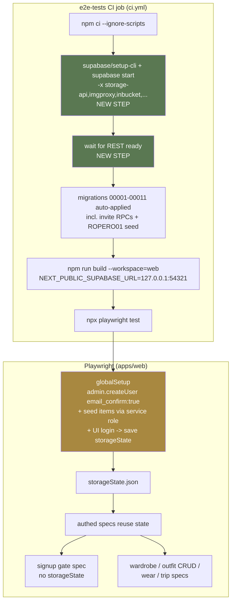

# feat: Build real test infrastructure for Ropero (web + backend)

## Summary

The web E2E suite is cosmetic: 4 spec files, 93 lines, asserting "either login or the page loaded" with `wardrobe.spec.ts` literally containing `expect(true).toBe(true)`. The root cause is structural, not lazy authoring: the `e2e-tests` CI job points the app at `127.0.0.1:54321` but **never starts a Supabase instance**, so no authenticated flow can execute. Separately, the RLS integration suite (`packages/supabase`) covers `items` / `outfits` / `trips` / `wear_logs` but has zero coverage of the invite system shipped in migrations 00006-00009, even though two of those migrations (00008, 00009) were security fixes. And `groupWearLogs` — the most complex pure function in the recent web work — is duplicated across web and mobile and untested.

This plan makes the test suite real along three independent axes: (1) stand up a live local Supabase in the E2E CI job and build a Playwright auth fixture so specs exercise authenticated surfaces; (2) extend the RLS suite to lock down the invite system's enumeration, redemption, and race-safety guarantees; (3) lift `groupWearLogs` into `@ropero/core` with unit tests. Strictly web + `packages/core` + `packages/supabase`. No Expo / mobile-device verification anywhere in the path.

---

## Problem Frame

**Who is affected:** developers (false confidence — green CI that proves almost nothing about user flows), and indirectly users (regressions in auth, wear logging, outfit CRUD, and invite redemption can ship undetected). The invite system is the highest-stakes gap: it gates all signups and had two post-launch security fixes with no regression tests guarding them.

**Why now:** the codebase has been stable since 2026-04-29. Before the next wave of surface redesigns (the deferred shape→craft passes) and the Supabase-types refactor land, a real safety net should exist so those changes are validated against behavior, not hope. Test infrastructure is the dependency that de-risks everything downstream.

**Current state (verified):**
- `apps/web/e2e/` — `auth.spec.ts` (44 lines, the only one with real assertions, all unauthenticated), `wardrobe.spec.ts` (`expect(true).toBe(true)`), `outfit.spec.ts` and `trip.spec.ts` (load-or-login no-ops).
- `apps/web/playwright.config.ts` — chromium only, `webServer` runs `npm run start` in CI, `baseURL` `localhost:3000`, no `globalSetup`, no `storageState`.
- `.github/workflows/ci.yml` — `e2e-tests` job builds and runs Playwright with `NEXT_PUBLIC_SUPABASE_URL` set but **no `supabase start`**. The `rls-tests` job *does* start Supabase (`supabase start -x storage-api,imgproxy,inbucket,edge-runtime,logflare,vector,supavisor`) and exports the demo anon + service-role keys.
- `packages/supabase/src/__tests__/rls.test.ts` — established harness: admin client creates two users via `auth.admin.createUser({ email_confirm: true })`, signs them in, builds per-user authenticated clients, tests cross-user isolation, cleans up in `afterAll`. Graceful `isSupabaseRunning()` skip-guard. No invite coverage.
- `apps/web/components/dashboard/recent-activity.tsx` — defines and exports `groupWearLogs`, `WearLogRow`, `ActivityEntry`, `MAX_ACTIVITY_ENTRIES` (cap 10). Imported by `apps/web/app/(app)/dashboard/page.tsx`. Mobile carries its own copies in `apps/mobile/app/(tabs)/index.tsx` and `apps/mobile/app/outfits/[id].tsx`.
- Invite model (migrations): `redeem_invite_code(invite_code text)` is `SECURITY DEFINER`, reads `auth.uid()` internally (00008 removed the spoofable `redeemer_id` param), rejects unauthenticated callers, locks the row `FOR UPDATE`. `validate_invite_code(p_code text)` is `SECURITY DEFINER`, `GRANT`ed to `anon, authenticated`, returns aggregate status only. 00009 dropped the `USING (true)` enumeration policy; the only surviving SELECT policy on `invite_codes` is owner-scoped (`user_id = auth.uid() OR user_id IS NULL`). Founder code `ROPERO01` (max_uses 9999, `user_id NULL`) is seeded in 00006.

---

## Requirements

Traceability back to the kickoff scope and KNOWN-ISSUES. Each maps to one or more implementation units.

- **R1** — The `e2e-tests` CI job runs a live local Supabase with all migrations applied, so authenticated flows execute. (U2)
- **R2** — A reusable Playwright auth fixture seeds a confirmed user and produces an authenticated `storageState`, so specs start logged in without re-driving the login form each time. (U3)
- **R3** — Real E2E specs replace the cosmetic ones, covering: invite-gated signup (gate behavior), authenticated wardrobe view, outfit create/edit/delete, wear logging, and trip create + packing-list view. (U4) — closes `[QA-2026-04-18] E2E tests are cosmetic`.
- **R4** — RLS integration tests cover the invite system: cross-user enumeration fails, anon cannot read `invite_codes`, `validate_invite_code` leaks no ids, `redeem_invite_code` rejects unauthenticated callers, increments usage atomically, records the caller's identity, rejects exhausted codes, and is race-safe under concurrent redemption. (U5) — closes `[QA-2026-04-18] RLS integration tests miss invite system`.
- **R5** — `groupWearLogs` (plus its `WearLogRow` / `ActivityEntry` types) lives in `@ropero/core` with unit tests covering the grouping, cap, and cap-then-increment invariants; web call sites import from core. (U1) — closes `[QA-2026-04-18] groupWearLogs is untested` and the web half of `Duplicated groupWearLogs on web and mobile`.
- **R6** — All three CI jobs (`check`, `rls-tests`, `e2e-tests`) pass. No change requires an Expo Go / iOS device run to verify. (all units)

---

## Key Technical Decisions

**KTD1 — E2E auth fixture uses admin-create + UI-login to capture cookies, not token injection.** Web auth is cookie-based SSR via `@supabase/ssr` (middleware). Injecting a `supabase-js` session into `localStorage` does not produce the cookie shape the SSR middleware reads. The robust, standard Playwright pattern is: in `globalSetup`, create a confirmed user with the service-role admin API (mirroring the RLS harness's `createUser({ email_confirm: true })`), then drive the real `/login` form once in a browser context and persist `storageState`. Specs reuse that state. This exercises the genuine cookie-auth path and is resilient to `@supabase/ssr` cookie-format changes.

**KTD2 — The signup E2E asserts the invite *gate*, not email confirmation.** `signUpWithEmail` ends at "Check your email to confirm your account"; redemption happens later in `apps/web/app/auth/callback/route.ts`. Completing confirmation in-browser would require Inbucket, which the CI Supabase start deliberately excludes. So the E2E covers: invalid code → error redirect; valid founder code (`ROPERO01`) → "check your email" message. The redemption logic itself is covered at the DB layer in U5. This keeps E2E fast and dependency-light while still proving the gate that protects every signup. (Alternative considered: set `enable_confirmations = false` in local `config.toml` to auto-confirm. Rejected — it diverges local behavior from production and couples the signup test to a config toggle; the gate + DB-layer split is cleaner.)

**KTD3 — Seed fixture data via the service-role admin client, not through the UI.** Outfit-CRUD and wear-logging specs need pre-existing items. Creating them through the add-item UI would pull in Supabase Storage (photo upload), which the CI Supabase start excludes. Seeding items directly (`photo_urls: []`, the shape the RLS test already uses) keeps the E2E Supabase footprint minimal and each spec focused on the flow under test.

**KTD4 — `groupWearLogs` gains a configurable cap parameter (default 10).** Web caps at 10; mobile's copy uses a different ratio (25/5 per its comment). Lifting with a `cap` parameter defaulting to 10 preserves web behavior exactly (callers pass nothing) while making the helper reusable by mobile in a later pass. The cap-then-increment invariant (once the cap is hit, no new entries are created but existing outfit groups keep incrementing) is preserved verbatim and becomes the headline test.

**KTD5 — Mobile call-site rewiring is deferred to a follow-up.** Swapping mobile's `groupWearLogs` to import from `@ropero/core` is a pure import change, CI-typecheck-covered and not actually Expo-blocked. But it touches `apps/mobile/` files and would widen this PR's blast radius beyond web + packages. To honor the deliberately-Expo-free framing and keep the diff reviewable, mobile rewiring is logged under Deferred Follow-Up Work, not done here. The web duplication is removed; the mobile duplication is explicitly tracked.

**KTD6 — Invite RLS tests extend the existing harness, not a new file.** `rls.test.ts` already has the user-creation, authenticated-client, and skip-guard scaffolding. A new `describe('invite system')` block reuses it. Concurrency (race-safety) is tested with `Promise.all` of two redemptions by two distinct authenticated users against a freshly seeded `max_uses: 1` code, asserting exactly one success.

---

## High-Level Technical Design

The load-bearing new shape is the E2E execution topology — five components in sequence that currently have a missing link (no DB). The diagram shows the target CI flow for the `e2e-tests` job.

Green nodes are the new CI steps that close the missing-DB gap (R1). The gold node is the auth fixture (R2). The signup-gate spec deliberately runs *without* `storageState` (it tests the unauthenticated entry path); all other specs consume the authenticated state.

---

## Scope Boundaries

### In scope
- `e2e-tests` CI job stands up local Supabase with migrations (R1).
- Playwright `globalSetup` + `storageState` auth fixture and a service-role seed helper (R2).
- Real E2E specs: signup gate, authenticated wardrobe, outfit CRUD, wear logging, trip + packing (R3).
- Invite-system RLS / RPC tests in the existing `rls.test.ts` (R4).
- `groupWearLogs` lifted to `@ropero/core` with unit tests; web call sites rewired (R5).
- KNOWN-ISSUES entries closed; session log updated.

### Deferred to Follow-Up Work
- **Mobile `groupWearLogs` rewire** to import from `@ropero/core` (KTD5). Pure import swap, typecheck-covered, but touches `apps/mobile/` — separate PR.
- **Full signup→confirm→redeem E2E** through Inbucket (KTD2). The gate + DB-layer redemption split covers the security surface; an end-to-end confirmation walk is a nice-to-have.
- **Add-item-with-photo E2E** (KTD3) — requires Storage in the CI Supabase start; out of scope for this pass.
- **Mobile test harness** (Jest + RN Testing Library) — tracked separately in KNOWN-ISSUES; Expo-adjacent, explicitly out of this Expo-free thread.
- **Lifting the other duplicated helpers** (`flattenOutfitItems`, wear-log insert) — separate tech-debt PR; only `groupWearLogs` is in scope here because it is the untested one.

### Non-goals
- No change to production behavior of any user-facing surface. This is purely additive test infrastructure (the one non-test code change is the `groupWearLogs` module move, which is behavior-preserving).
- No Supabase schema/migration changes.
- No mobile-device or Expo Go verification.

---

## Implementation Units

### U1. Lift `groupWearLogs` into `@ropero/core` with unit tests

**Goal:** Make the most complex untested pure function testable and shared. Behavior-preserving move plus comprehensive unit coverage.

**Requirements:** R5.

**Dependencies:** none (fully independent — good first landing).

**Files:**
- `packages/core/src/wear/group-wear-logs.ts` (new) — `groupWearLogs`, `WearLogRow`, `ActivityEntry`, `MAX_ACTIVITY_ENTRIES`, with an optional `cap` parameter (default `MAX_ACTIVITY_ENTRIES`).
- `packages/core/src/wear/index.ts` (new) — re-export.
- `packages/core/src/index.ts` (modify) — add `export * from './wear';`.
- `packages/core/src/wear/__tests__/group-wear-logs.test.ts` (new) — unit tests.
- `apps/web/components/dashboard/recent-activity.tsx` (modify) — import `groupWearLogs` + types from `@ropero/core`; drop the local definition (optionally re-export the type for local consumers if needed).
- `apps/web/app/(app)/dashboard/page.tsx` (modify) — update its import to `@ropero/core`.

**Approach:** Move the function and its types verbatim into core; generalize only the cap (KTD4). Web consumers import from `@ropero/core`. Keep `WearLogRow` shape identical so the dashboard query and `RecentActivity` props are unaffected. Mirror the existing core test layout (`<module>/__tests__/<name>.test.ts`, Vitest).

**Patterns to follow:** `packages/core/src/validation/__tests__/item.test.ts` for Vitest structure; existing barrel-export pattern in `packages/core/src/index.ts`.

**Test scenarios** (`group-wear-logs.test.ts`):
- Happy: standalone item rows pass through as `kind:'item'` entries preserving input order.
- Happy: two rows sharing `outfit_id` + `worn_at` collapse to one `kind:'outfit'` entry with `item_count: 2`.
- Edge: same `outfit_id`, different `worn_at` → two separate outfit entries (key is `outfit_id:worn_at`).
- Edge: empty input → `[]`.
- Edge: `outfits` is `null` → `outfit_name` falls back to `'Outfit'`.
- Invariant (headline): with `cap = 10` and 12 distinct groups, returns exactly 10 entries.
- Invariant (cap-then-increment): after the cap is reached, a further row matching an *existing pre-cap* outfit group still increments that group's `item_count`; a *new* group beyond the cap is dropped.
- Param: a custom `cap` (e.g. 2) is honored.
- Order preservation: server-side order (worn_at desc, created_at desc as given) is preserved in output.

**Verification:** `npm run test --workspace=@ropero/core` passes including the new file; `npm run typecheck` clean across workspaces; web dashboard renders identically (no behavioral diff).

---

### U2. Start local Supabase in the `e2e-tests` CI job

**Goal:** Close the missing-DB gap so authenticated E2E can run in CI (R1).

**Requirements:** R1, R6.

**Dependencies:** none (but U3/U4 depend on this to be meaningful).

**Files:**
- `.github/workflows/ci.yml` (modify, `e2e-tests` job only).

**Approach:** Insert, after `npm ci --ignore-scripts` and before the build, the same Supabase bring-up the `rls-tests` job already uses: `supabase/setup-cli@v2`, `supabase start -x storage-api,imgproxy,inbucket,edge-runtime,logflare,vector,supavisor` (Storage excluded per KTD3; data seeded directly), and the REST readiness wait loop. Add the service-role and anon keys plus `SUPABASE_URL` to the job env so `globalSetup` can seed and the app can talk to the DB. `NEXT_PUBLIC_SUPABASE_URL` / `NEXT_PUBLIC_SUPABASE_ANON_KEY` are already present at job level (build-time inlined). Keep `npm run build` after the DB is up.

**Patterns to follow:** the existing `rls-tests` job in the same file (setup-cli, start with `-x`, the 30-iteration curl wait loop, demo keys).

**Test scenarios:** `Test expectation: none -- CI configuration. Verified by U4 specs passing against the live DB in CI.`

**Verification:** the `e2e-tests` job reaches and passes the authenticated specs in CI; migrations 00001-00011 (incl. invite RPCs and the `ROPERO01` seed) are applied automatically by `supabase start`.

---

### U3. Playwright auth fixture (globalSetup + storageState + seed helper)

**Goal:** Provide a reusable authenticated browser state and seeded data so specs start logged in (R2).

**Requirements:** R2.

**Dependencies:** U2 (needs a live DB).

**Files:**
- `apps/web/e2e/global-setup.ts` (new) — create confirmed user via admin API, seed a small fixed set of items, drive `/login`, persist `storageState`.
- `apps/web/e2e/fixtures/seed.ts` (new) — service-role helpers (`createTestUser`, `seedItems`, `seedOutfit`, optional `createInviteCode` for exhausted/limited cases).
- `apps/web/e2e/fixtures/auth.ts` (new, optional) — typed access to the seeded user's id/email for specs.
- `apps/web/playwright.config.ts` (modify) — add `globalSetup` and a project-level `storageState` (and/or a separate unauthenticated project for the signup spec).
- `apps/web/.gitignore` or root ignore (modify) — ignore the generated `storageState` artifact (e.g. `e2e/.auth/`).

**Approach (KTD1, KTD3):** `globalSetup` uses `@supabase/supabase-js` with the service-role key to `createUser({ email_confirm: true })` and seed items; then opens a browser context, fills the `/login` form ("Welcome back", Email/Password, "Sign in"), waits for the post-login redirect, and writes `storageState` to `e2e/.auth/user.json`. Config exposes two projects: an authenticated one (default `storageState`) for wardrobe/outfit/wear/trip specs, and an unauthenticated one for the signup-gate spec. Env (`SUPABASE_URL`, `SUPABASE_SERVICE_ROLE_KEY`, `SUPABASE_ANON_KEY`) comes from the job env added in U2; locally these default to the demo values (mirror `rls.test.ts` defaults) so a developer with `supabase start` can run E2E too.

**Execution note:** Build the fixture against a real `supabase start` locally first (Docker), confirm `storageState` yields an authenticated `/dashboard` (no redirect to `/login`), then wire CI.

**Patterns to follow:** `packages/supabase/src/__tests__/rls.test.ts` for the admin-create + sign-in + seed shapes and the demo-key env defaults.

**Test scenarios:** the fixture is validated by a smoke assertion in U4 (authenticated `/dashboard` shows user content, not the login form). `Test expectation: covered transitively by U4's authenticated specs.`

**Verification:** running `npx playwright test` locally against a live Supabase produces a populated `storageState`; a spec using it lands on `/dashboard` authenticated.

---

### U4. Replace cosmetic E2E specs with real authenticated flows

**Goal:** Exercise the actual product flows end to end (R3). Close `[QA-2026-04-18] E2E tests are cosmetic`.

**Requirements:** R3, R6.

**Dependencies:** U2, U3.

**Files:**
- `apps/web/e2e/auth.spec.ts` (modify) — keep the unauthenticated page-load + redirect assertions; add a real authenticated-redirect assertion now that auth works.
- `apps/web/e2e/signup.spec.ts` (new) — invite-gate behavior (unauthenticated project).
- `apps/web/e2e/wardrobe.spec.ts` (rewrite) — authenticated: grid renders seeded items; remove `expect(true).toBe(true)`.
- `apps/web/e2e/outfit.spec.ts` (rewrite) — authenticated: create → edit → delete an outfit from seeded items.
- `apps/web/e2e/wear.spec.ts` (new) — authenticated: log a wear; recent activity / wear count reflects it.
- `apps/web/e2e/trip.spec.ts` (rewrite) — authenticated: create a trip; packing list view renders.

**Approach:** Each authenticated spec consumes `storageState` and drives the real UI with role/label selectors (consistent with `auth.spec.ts`'s `getByRole`/`getByLabel` style). Assert on user-visible outcomes (item names, wear count increment, outfit appears then disappears after delete). The signup spec runs unauthenticated and asserts: (a) invalid code → stays on `/signup` with an error message; (b) `ROPERO01` + valid fields → "Check your email to confirm your account" message (KTD2). Keep specs hermetic: data each spec mutates should be created by that spec or clearly isolated from the shared seed (e.g., outfit/trip specs create their own named entities and clean up).

**Patterns to follow:** `auth.spec.ts` selector idioms; Playwright `test.describe` grouping already in use.

**Test scenarios:**
- Signup: invalid invite code → error, no account created (Covers the invite gate).
- Signup: valid founder code + valid email/password → "check your email" confirmation message.
- Auth: unauthenticated `/dashboard` redirects to `/login`; authenticated `/dashboard` shows dashboard content.
- Wardrobe: authenticated `/wardrobe` shows seeded item names; masthead piece count reflects seed.
- Outfit: create a named outfit from ≥2 seeded items → appears in `/outfits`; edit name → reflects; delete → removed.
- Wear: log a wear for a seeded item → recent activity shows it / wear count increments.
- Trip: create a trip with dates + destination → `/trips/[id]` renders the packing list view.

**Verification:** `npx playwright test` green locally (live Supabase) and in CI; no spec contains a tautological assertion; failures produce the existing artifact upload.

---

### U5. Invite-system RLS and RPC tests

**Goal:** Guard the invite system's enumeration, redemption, identity, exhaustion, and race-safety properties (R4). Close `[QA-2026-04-18] RLS integration tests miss invite system`.

**Requirements:** R4, R6.

**Dependencies:** none (reuses the existing RLS harness; runs in `rls-tests` job which already starts Supabase).

**Files:**
- `packages/supabase/src/__tests__/rls.test.ts` (modify) — add a `describe('invite system')` block.

**Approach (KTD6):** Reuse the harness's two authenticated users + admin client + `isSupabaseRunning` skip-guard. For exhaustion and race tests, seed dedicated codes via the admin (service-role) client with controlled `max_uses`. Use an anon client (no Authorization header) to assert the unauthenticated and enumeration-denied paths. Assert RPC return shapes (`json_build_object`) precisely.

**Patterns to follow:** the existing per-table `describe` blocks, `createAuthenticatedClient`, the `supabaseRunning` early-return idiom, and the `Date.now()`-suffixed unique emails.

**Test scenarios:**
- Enumeration: authenticated User B `.from('invite_codes').select().eq('code', <A's personal code>)` → `[]` (owner policy only; 00009 removed `USING(true)`).
- Anon: anon client `.from('invite_codes').select('*')` → empty / denied (no policy matches anon).
- Owner read: User A can read own auto-generated code and the founder seed row (`user_id IS NULL`).
- `validate_invite_code('ROPERO01')` as anon → `valid: true` with `times_used`/`max_uses`, and **no** `id`/`user_id` fields leaked.
- `validate_invite_code('NONEXISTENT')` → `valid: false, reason: 'not_found'`.
- `validate_invite_code` on a seeded `max_uses:1, times_used:1` code → `valid: false, reason: 'exhausted'`.
- `redeem_invite_code('ROPERO01')` via anon client (no session) → `success: false, error: 'Not authenticated'` (00008 reads `auth.uid()`).
- Redeem happy path: authenticated User B redeems the founder code → `success: true`; `times_used` increments by 1; an `invite_redemptions` row exists with `redeemed_by` = User B's id.
- Identity: confirm the spoofable 2-arg signature is gone — redemption records the caller's id, not a supplied one (single-arg signature only).
- Exhausted: redeem a seeded `max_uses:1` already-used code → `success: false, error: 'Invite code has reached maximum uses'`.
- Race-safety: seed a fresh `max_uses:1` code; `Promise.all` two concurrent `redeem_invite_code` calls from two distinct authenticated users → exactly one `success:true`, one `maximum uses` (FOR UPDATE serialization).
- `invite_redemptions`: User B cannot SELECT redemptions belonging to User A's codes.

**Verification:** `npm run test --workspace=@ropero/supabase` green with Supabase running; the suite still skips cleanly when Supabase is down (preserve the skip-guard so local `npm run test` without Docker is not broken).

---

### U6. Close KNOWN-ISSUES entries and update docs

**Goal:** Reflect the new coverage in the trackers (doc-only).

**Requirements:** R3, R4, R5 (closure bookkeeping).

**Dependencies:** U1, U4, U5 (close only what actually landed).

**Files:**
- `KNOWN-ISSUES.md` (modify) — mark resolved with a dated note: "E2E tests are cosmetic", "RLS integration tests miss invite system", "groupWearLogs is untested"; update "Duplicated groupWearLogs on web and mobile" to note the web half is consolidated and mobile rewiring is the remaining follow-up.
- `docs/sessions/2026-06-22-*.md` + `SESSION-LOG.md` (the /lfg pipeline / session close handles this).

**Approach:** Strike-through or annotate resolved entries following the existing `[DESIGN-SYSTEM-2026-04-24] — RESOLVED` precedent in the file. Do not over-close: the "Duplicated groupWearLogs" entry stays partially open (mobile) until KTD5's follow-up.

**Test scenarios:** `Test expectation: none -- documentation.`

**Verification:** KNOWN-ISSUES reflects reality; no entry claims closure beyond what shipped.

---

## Risk Analysis & Mitigation

- **R-A: Cookie-SSR auth in `globalSetup` is fiddly.** Token injection won't match `@supabase/ssr`'s cookie format. *Mitigation:* KTD1 — drive the real login form to capture genuine cookies; validate locally against `supabase start` before CI.
- **R-B: E2E flakiness / timeouts in CI.** First-time Supabase bring-up plus build plus browser can be slow. *Mitigation:* reuse the proven `rls-tests` bring-up + readiness wait; the config already sets `retries: 2` and `workers: 1` in CI; seed via service role (fast) rather than UI.
- **R-C: Email-confirmation friction.** Signup creates an unconfirmed user. *Mitigation:* KTD2 — fixture users are admin-created with `email_confirm: true`; the signup spec stops at the gate/message and does not confirm.
- **R-D: Storage excluded from CI Supabase.** Add-item photo upload would fail. *Mitigation:* KTD3 — seed items directly; no spec drives photo upload (deferred).
- **R-E: `groupWearLogs` move changes web behavior.** *Mitigation:* verbatim move, cap defaults to current value, unit tests assert the exact prior invariants; dashboard render unchanged.
- **R-F: Race-safety test is itself racy.** Two concurrent redemptions may both appear to win if `FOR UPDATE` weren't effective — which is exactly what the test should catch, but it must be deterministic. *Mitigation:* use a `max_uses:1` code and assert the *count* of successes is exactly 1 across the settled `Promise.all`, not ordering.

---

## Phased Delivery

Independent landing order; each phase is green on its own and can be reviewed in isolation if the implementer chooses to split commits.

1. **Phase A — Pure-logic, zero infra (U1).** Lowest risk, immediate value, no DB. Lands first.
2. **Phase B — RLS invite coverage (U5).** Uses the already-working `rls-tests` job; no E2E infra needed. High security value.
3. **Phase C — E2E infrastructure (U2 → U3).** The DB-in-CI change and the auth fixture; validated locally before pushing.
4. **Phase D — Real E2E specs (U4).** Builds on C.
5. **Phase E — Bookkeeping (U6).** Close the tracker entries that actually shipped.

A natural fallback if E2E infra proves stubborn in CI: Phases A + B + E deliver real value (core helper tested, invite system guarded, trackers updated) even if the E2E phases need a second iteration — they are independent.

---

## Sources & Research

All grounding is in-repo (no external research needed — this is codebase-internal test work against well-established local patterns):
- `apps/web/e2e/*.spec.ts`, `apps/web/playwright.config.ts` — current cosmetic state.
- `.github/workflows/ci.yml` — the three CI jobs; the `e2e-tests` missing-DB gap and the `rls-tests` bring-up to mirror.
- `packages/supabase/src/__tests__/rls.test.ts` — the harness to extend.
- `supabase/migrations/00006`, `00008`, `00009` — invite schema, the de-spoofed `redeem_invite_code`, the locked-down SELECT + `validate_invite_code`, the `ROPERO01` seed.
- `apps/web/app/(auth)/signup/page.tsx` — the gate-then-defer-redemption flow (KTD2).
- `apps/web/components/dashboard/recent-activity.tsx` — `groupWearLogs` source and its cap-then-increment invariant.
- `KNOWN-ISSUES.md` — the four entries this plan closes.
