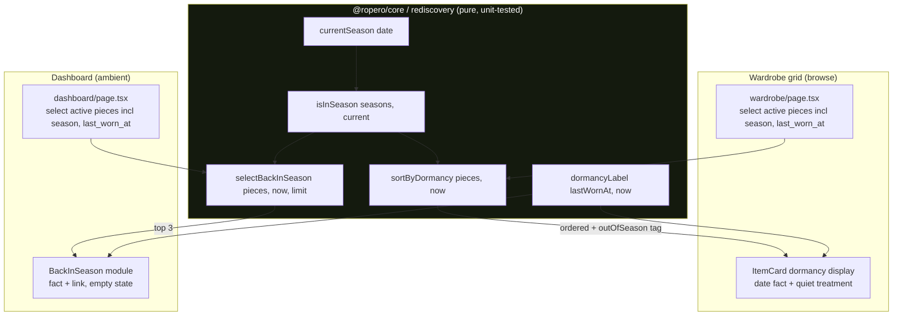

# feat: Rediscovery surface (dormancy lens + seasonal re-encounter)

## Summary

Surface the pieces a user owns but has stopped reaching for, so the closet answers "what could I be wearing that I'm not?" before the impulse to buy. Web-first, on existing screens: a season-aware **dormancy sort** in the wardrobe grid (active browse) and a quiet **"back in season" module** on the dashboard (ambient). The season and dormancy logic lives as pure, unit-tested functions in `@ropero/core`; the web surfaces are thin wiring over it. Mirror not coach: concrete date facts ("not worn since October"), no labels, no thresholds-as-verdicts, no prompts. (See origin: `docs/brainstorms/2026-06-22-rediscovery-surface-requirements.md`.)

## Problem Frame

Ropero captures every wear, so "last worn" is computable today, but nothing surfaces *absence*. The wardrobe grid sorts by recency/cost-per-wear/signature; the dashboard shows recent activity. A re-wearer who wants to find the forgotten can only scroll the whole grid and rely on memory. This plan turns already-captured data into the re-wearer's headline experience at low carrying cost (no new screens, no new tables). Affected: end users (the re-wearer primarily, the curator secondarily); no operational or cross-team impact.

## Requirements

Traceability to the origin requirements doc (R1-R14). Each maps to one or more units.

- **R1-R6** (dormancy lens): the wardrobe gains a season-aware dormancy sort, ordered by time-since-worn with in-season first, stating concrete date facts, no hard threshold, no "Dormant" label, honoring existing filters/active-scope. (U1, U2, U3)
- **R7-R10** (seasonal re-encounter module): a quiet dashboard module surfacing a bounded set of in-season, not-recently-worn pieces as fact, with a calm empty/low-data state. (U1, U4)
- **R11-R14** (voice, action, restraint): mirror-voice copy, pull-based, reflective (tap to detail, no in-place CTAs), serves the re-wearer without narrowing the product. (U2, U3, U4)

---

## Key Technical Decisions

Resolutions of the origin doc's seven open questions, plus the core-placement decision.

- **KTD1 - Current season from the calendar, not weather.** `currentSeason(date)` derives the season from the month (northern-hemisphere mapping: Dec-Feb winter, Mar-May spring, Jun-Aug summer, Sep-Nov fall). Pure, testable, no coupling to weather availability. Weather/location-aware season is deferred (see Scope Boundaries). Northern hemisphere is a documented assumption.
- **KTD2 - "Recently worn within season" = not worn since the current season window began.** A piece qualifies for the dashboard module when it is in-season now AND (`last_worn_at` is null OR `last_worn_at` is before the start of the current season's window this year). This is what makes "back in season" mean "you haven't reached for it this season," not "ever."
- **KTD3 - Dashboard module: fixed small set, deterministic and stable.** Show the top 3 qualifying pieces ordered by dormancy (most-dormant first). Selection is a pure function of the data, identical across loads within the same day, never randomized (no slot-machine feel). When fewer than 3 qualify, show what there is; when zero, render the empty state or omit.
- **KTD4 - Dormancy lens ships as a new sort option** in the existing `ItemFilters` sort control, applied post-fetch (mirroring how `cost-per-wear` already sorts post-fetch in `wardrobe/page.tsx`). No new mode/toggle, no new screen. Composes with the existing category/season filters and the active/archive segmented control (dormancy operates over active pieces).
- **KTD5 - Out-of-season pieces: one grid, visually quieted.** In the dormancy sort, in-season pieces order first; out-of-season "resting" pieces follow in the same grid at reduced opacity, never blended into the in-season "forgotten" signal and never a separate section.
- **KTD6 - Ordering and tiebreakers.** Within in-season (then within out-of-season): never-worn pieces (`last_worn_at` null) rank as most-dormant and surface first, then by `last_worn_at` ascending (oldest first), with a stable `id` ascending tiebreaker (reusing the pattern already in `wardrobe/page.tsx`).
- **KTD7 - Web-first, confirmed.** Mobile parity is a separate follow-up; this plan touches `apps/web` + `packages/core` only.
- **KTD8 - Pure logic in `@ropero/core`, web is thin wiring.** Season derivation, dormancy ordering, the module selection, and the mirror-voice date label all live in a new `packages/core/src/rediscovery` module behind unit tests. The wardrobe page and dashboard call into it. This honors CLAUDE.md ("never define data types in app code," business logic in core) and makes the only logic worth testing testable without the DB or browser.

---

## High-Level Technical Design

Two server-rendered surfaces, one shared pure-logic core module. The wardrobe page orders its existing fetch through the dormancy comparator; the dashboard runs a separate small fetch through the selection function. Neither needs a new query layer or table.

---

## Implementation Units

### U1. Core rediscovery logic in `@ropero/core` (pure, test-first)

**Goal:** The season + dormancy + selection + label logic as pure functions with full unit coverage. This is the heart; everything else is wiring.

**Requirements:** R1-R10 (the computable substance), R11 (the label is mirror-voice).

**Dependencies:** none.

**Files:**
- `packages/core/src/rediscovery/dormancy.ts` (new) - the functions + the input type.
- `packages/core/src/rediscovery/index.ts` (new) - barrel.
- `packages/core/src/index.ts` (modify) - add `export * from './rediscovery';`.
- `packages/core/src/rediscovery/__tests__/dormancy.test.ts` (new) - unit tests.

**Approach:** Reuse the `Season` / `SEASONS` definitions from `packages/core/src/validation/item.ts` rather than redefining. Expose:
- `currentSeason(date: Date): Season` (KTD1).
- `isInSeason(seasons: Season[], current: Season): boolean` - empty/absent `seasons` array counts as always in-season (KTD6 edge).
- `sortByDormancy(pieces, now): Array<piece & { outOfSeason: boolean }>` - season-aware ordering per KTD5/KTD6, tagging each piece's `outOfSeason`.
- `selectBackInSeason(pieces, now, limit): pieces[]` - in-season AND not-worn-this-season (KTD2), top `limit` by dormancy (KTD3).
- `dormancyLabel(lastWornAt: string | null, now: Date): string` - "not worn yet" when null/never; otherwise "not worn since <Month>" (or a longer-ago form). **Parse the bare `YYYY-MM-DD` safely** (append `T00:00:00` or compare date-only) to avoid the UTC off-by-one that the web/mobile `formatDate` copies have (KNOWN-ISSUES `[QA-2026-04-18]`); this is the correct home for that logic.
- A `RediscoveryPiece` input interface (`id`, `season: Season[]`, `last_worn_at: string | null`) so callers pass a minimal shape.

**Execution note:** Implement test-first - write the failing unit tests for each function, then implement.

**Patterns to follow:** `packages/core/src/wear/group-wear-logs.ts` (a recent pure-logic module with a configurable param and a `__tests__` sibling) and its test file for structure and the Vitest idiom.

**Test scenarios:**
- `currentSeason`: each month maps to the expected season (12 cases, or representative boundaries Feb/Mar, May/Jun, Aug/Sep, Nov/Dec). Covers AE-adjacent season derivation.
- `isInSeason`: piece with `['summer']` is in-season in June, not in December; piece with `[]` is in-season in any month.
- `sortByDormancy`: in-season pieces precede out-of-season regardless of raw recency (Covers AE2: a winter coat in July does not take a top slot). Never-worn piece ranks above a worn piece within its season group (Covers AE3). Among worn in-season pieces, older `last_worn_at` precedes newer. Equal `last_worn_at` resolves by `id` ascending (stable). Each returned piece carries the correct `outOfSeason` tag.
- `selectBackInSeason`: returns only in-season pieces not worn since the season window began; never-worn in-season pieces are included; caps at `limit`; deterministic order across calls with identical input (Covers AE4); returns `[]` when nothing qualifies (Covers AE5).
- `dormancyLabel`: null -> "not worn yet" (Covers AE3); a date last winter -> "not worn since <Month>"; a `YYYY-MM-DD` near a month boundary does not shift a month due to UTC parsing (timezone-safe).

**Verification:** `npm run test --workspace=@ropero/core` green including the new file; `npm run typecheck` clean.

---

### U2. Wardrobe dormancy sort option

**Goal:** Add the dormancy sort to the wardrobe grid, ordering via the core function and selecting the fields it needs.

**Requirements:** R1, R2, R3, R5, R6, R12, R14.

**Dependencies:** U1.

**Files:**
- `apps/web/components/wardrobe/item-filters.tsx` (modify) - add the new sort option to the sort control.
- `apps/web/app/(app)/wardrobe/page.tsx` (modify) - add `season` to the select list (currently selected: `id, name, brand, color_primary, photo_urls, times_worn, is_signature, status, purchase_price, created_at, last_worn_at` - `season` is filtered on but not selected); add a `dormant` sort branch that orders post-fetch via `sortByDormancy` (mirroring the existing post-fetch `cost-per-wear` branch); thread the per-item `outOfSeason` tag and `last_worn_at` into the card.

**Approach:** The new sort value (e.g. `dormant`) triggers post-fetch ordering through `sortByDormancy` rather than a SQL `.order()`, exactly as `cost-per-wear` already does. The `WardrobeRow` type gains `season`. When the active sort is the dormancy sort, the page renders cards in "dormancy mode" (U3), passing `{ lastWornAt, outOfSeason }`. Other sorts are unaffected. Copy for the sort label stays in the editorial register (e.g. "By last worn" / "Least recently worn"), never "Dormant" (R5).

**Patterns to follow:** the existing `switch (sort)` block and the post-fetch `cost-per-wear` sort in `wardrobe/page.tsx`; the `ItemFilters` sort-options list.

**Test scenarios:** `Test expectation: ordering correctness is covered by U1's `sortByDormancy` unit tests; this unit is server-component wiring.` Optionally, an E2E (authenticated) that selects the dormancy sort and asserts a seeded never-worn in-season piece appears before a recently-worn one (extends the existing `apps/web/e2e` suite and its seed fixture).

**Verification:** selecting the dormancy sort reorders the grid season-aware-first; existing sorts unchanged; `npm run typecheck` and `npm run lint --workspace=@ropero/web` clean.

---

### U3. Item-card dormancy display

**Goal:** In dormancy mode, each card states its own last-worn fact and quiets out-of-season pieces; pure-view, no new actions.

**Requirements:** R4, R5, R13 (reflective; tap still goes to detail).

**Dependencies:** U1, U2.

**Files:**
- `apps/web/components/wardrobe/item-card.tsx` (modify) - add an optional `dormancy?: { lastWornAt: string | null; outOfSeason: boolean }` prop. When present, render the `dormancyLabel(...)` fact (gold, `tabular-nums`, per the gold-marks-the-data rule) in place of the `times_worn` `Nx`, and apply a reduced-opacity treatment to the card when `outOfSeason`. When absent, the card is unchanged.

**Approach:** Keep the existing `Link`-to-detail wrapper untouched (R13: tap -> detail, no in-place CTAs). The dormancy fact replaces the wear-count line in dormancy mode because recency, not frequency, is the relevant datum there. The gold rule applies to the date/duration; the surrounding words stay neutral. The out-of-season quiet treatment is opacity only (no badge, no label - R5).

**Patterns to follow:** the card's existing `times_worn` gold rendering (both compact and regular branches) for the gold + `tabular-nums` treatment; `ARCHIVE_STATUS_LABEL` for how a secondary state reads quietly.

**Test scenarios:** `Test expectation: presentational; the label text + timezone-safety are covered by U1's `dormancyLabel` tests.` Visual verification: a never-worn card reads "not worn yet" (Covers AE3); a worn card reads "not worn since <Month>"; an out-of-season card is visibly quieted (Covers AE2); tapping any card opens its detail page (Covers AE6).

**Verification:** dormancy-mode cards show the date fact in gold and quiet out-of-season pieces; non-dormancy views render exactly as before; typecheck + lint clean.

---

### U4. Dashboard "back in season" module

**Goal:** A quiet dashboard module surfacing a few in-season, not-recently-worn pieces as fact, with a calm empty state.

**Requirements:** R7, R8, R9, R10, R11, R12, R13.

**Dependencies:** U1.

**Files:**
- `apps/web/components/dashboard/back-in-season.tsx` (new) - the module component.
- `apps/web/app/(app)/dashboard/page.tsx` (modify) - add one query for active pieces with the needed columns (`id, name, photo_urls, season, last_worn_at`) to the existing `Promise.all`, run it through `selectBackInSeason` from core, and render the module in the dashboard layout.

**Approach:** Fetch active pieces with the minimal columns (wardrobes are small; the existing dashboard already issues ~10 parallel queries, so one more is in keeping). Compute the selection in core (`selectBackInSeason`, KTD2/KTD3) rather than in SQL, because "in-season" depends on the computed current season and on empty-`season` pieces counting as in-season. Each surfaced piece shows its `dormancyLabel` fact in gold and links to `/wardrobe/[id]` (R9, R13). No "wear this" affordance (R11). When the selection is empty (new account, everything recently worn), render a calm one-line state or omit the module (R10).

**Patterns to follow:** the existing dashboard modules (`components/dashboard/recent-activity.tsx`, `upcoming-trips.tsx`) for weight, card treatment, and the empty-state idiom; the dashboard's `Promise.all` fetch block and its `sb` cast.

**Test scenarios:** `Test expectation: selection logic is covered by U1's `selectBackInSeason` tests; this unit is module rendering + one query.` Visual: with seeded in-season dormant pieces the module lists up to 3 with gold facts linking to detail (Covers AE4); with a fresh/empty account the module shows the calm empty state, never a void or a nudge (Covers AE5).

**Verification:** the module renders the right pieces and the empty state; the rest of the dashboard is unchanged; typecheck + lint clean.

---

## Scope Boundaries

### In scope
- `@ropero/core` rediscovery logic with unit tests (U1).
- Wardrobe dormancy sort + card dormancy display (U2, U3).
- Dashboard "back in season" module + empty state (U4).

### Deferred to Follow-Up Work
- **Weather/location-aware current season** (KTD1 uses the calendar). Revisit once the calendar season proves too coarse; `fetch-weather` is available to feed it.
- **Mobile parity** for both surfaces (KTD7).
- **A dedicated rediscovery surface / nav destination**, and **in-place actions** on the rediscovery surfaces - both deferred in the origin doc; earn with usage evidence. The in-place-action deferral shares its rationale with KNOWN-ISSUES `[SHAPE-WARDROBE-2026-04-29]`.
- **An E2E for the dormancy sort** beyond the U1 unit coverage (optional hardening on the existing `apps/web/e2e` harness).

### Outside this product's identity (do not build)
- Prescriptive/motivational framing ("you should wear this," re-wear streaks).
- Notifications, push, or any re-engagement mechanic.
- A "Dormant" verdict label, a percentile/ranking, or any classification that judges rather than reflects.
- A buy/resale/marketplace affordance on forgotten pieces.

---

## Acceptance Examples

Carried from the origin (AE1-AE6); each is referenced by the unit/test that enforces it.

- **AE1** (in-season piece reads "not worn since August," date in gold) - U3 display + U1 `dormancyLabel`.
- **AE2** (out-of-season wool coat in July is de-emphasized, not top-of-list) - U1 `sortByDormancy` + U3 quiet treatment.
- **AE3** (never-worn piece reads "not worn yet" and ranks as a strong candidate) - U1 `sortByDormancy` + `dormancyLabel`.
- **AE4** (dashboard surfaces an in-season not-worn-this-season jacket with a detail link, no instruction) - U1 `selectBackInSeason` + U4.
- **AE5** (new account: calm empty state, honest "not worn yet," no fabricated suggestion) - U1 (empty selection) + U3/U4 empty states.
- **AE6** (tapping a resurfaced piece opens its existing detail page; no wear/outfit buttons on the surface) - U3/U4 (link-only, no CTAs).

---

## Risks & Mitigations

- **R-A: Date timezone off-by-one in the label.** The existing web/mobile `formatDate` mis-parses bare `YYYY-MM-DD` as UTC midnight (KNOWN-ISSUES). *Mitigation:* `dormancyLabel` in core parses date-only/`T00:00:00` and is unit-tested at month boundaries (U1) - doing it right in the one tested place.
- **R-B: Hemisphere assumption.** Calendar season is northern-hemisphere-correct only. *Mitigation:* documented assumption (KTD1); weather-aware season is the deferred follow-up. Low harm for the initial user base.
- **R-C: Dashboard query cost.** One more `Promise.all` query fetching active pieces. *Mitigation:* wardrobes are small (dozens of rows) and the dashboard already runs ~10 parallel queries; select only the needed columns.
- **R-D: Out-of-season noise (the trust test).** If in-season ordering is wrong, resting pieces pollute the "forgotten" signal. *Mitigation:* the in-season-first invariant is the headline `sortByDormancy` unit test (U1, AE2).

---

## Sources & Research

In-repo, verified against current code (no external research needed - strong recent local patterns):
- `docs/brainstorms/2026-06-22-rediscovery-surface-requirements.md` - origin (A/F/R/AE, decisions, deferrals).
- `apps/web/app/(app)/wardrobe/page.tsx` - the `switch (sort)` block, the post-fetch `cost-per-wear` sort, the `id` tiebreaker, the select list (confirms `season` is filtered but not selected).
- `apps/web/components/wardrobe/item-card.tsx` - `WardrobeCardItem` shape and the gold `times_worn` rendering to mirror.
- `apps/web/components/wardrobe/item-filters.tsx` - the sort control to extend.
- `apps/web/app/(app)/dashboard/page.tsx` - the `Promise.all` fetch pattern and module layout.
- `packages/core/src/validation/item.ts` - `SEASONS` / `Season` to reuse.
- `packages/core/src/wear/group-wear-logs.ts` - the pure-logic + `__tests__` pattern to follow.
- KNOWN-ISSUES.md `[QA-2026-04-18]` (formatDate timezone) and `[SHAPE-WARDROBE-2026-04-29]` (deferred card quick-actions).
